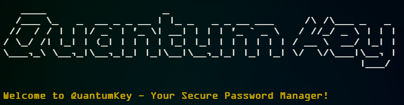

# QuantumKey - Your Secure Password Manager

 <!-- Optional: Include a logo or image if available -->

## Table of Contents
- [Introduction](#introduction)
- [Features](#features)
- [Installation](#installation)
- [Usage](#usage)
- [Setup TOTP (Two-Factor Authentication)](#setup-totp-two-factor-authentication)
- [Requirements](#requirements)
- [Contact](#contact)

## Introduction

**QuantumKey** is a command-line password manager that implements state-of-the-art security practices to ensure the confidentiality and integrity of user passwords. It leverages industry-standard encryption and hashing algorithms to protect sensitive information and provides the option for Two-Factor Authentication (TOTP) to enhance account security.

## Technical Features

- **Secure Password Storage:**
  - Passwords are encrypted using the Advanced Encryption Standard (AES) with a 256-bit key in Cipher Block Chaining (CBC) mode. This provides robust encryption that is widely accepted and recommended for secure data storage.

- **Master Password Hashing:**
  - The master password is hashed using the bcrypt algorithm, which includes a cryptographic salt to prevent rainbow table attacks. Bcrypt is a password hashing function designed to be computationally intensive, making brute-force attacks impractical.

- **Two-Factor Authentication (TOTP):**
  - Time-based One-Time Passwords (TOTP) are generated using the PyOTP library. The TOTP secret is securely generated and can be scanned as a QR code for easy integration with authenticator applications (e.g., Google Authenticator, Authy).

- **Secure File Permissions:**
  - The application ensures that sensitive files (such as the master password hash and encryption keys) are stored with restricted file permissions (e.g., `0600` on UNIX-like systems) to prevent unauthorized access.

- **User-Friendly Command-Line Interface:**
- The command-line interface is designed for ease of use, allowing users to save, retrieve, and manage passwords efficiently while maintaining a focus on security.

## Installation

1. Clone the repository:
   ```bash
   git clone https://github.com/Sohamisaniceguy/Quantum_Key.git
   cd QuantumKey

2. Create a Python virtual environment (optional but recommended):


python -m venv venv
source venv/bin/activate  # On Windows use `venv\Scripts\activate`

3. Install the required packages:

pip install -r requirements.txt


## Usage

1. Run the application:

python quantumkey.py

2. Follow the on-screen instructions to set up your master password and TOTP.

3. Use the menu options to save, retrieve, and manage your passwords.

## Setup TOTP (Two-Factor Authentication)
To set up TOTP:

1. After setting your master password, a TOTP secret will be generated.
2. Scan the provided QR code with your authenticator app (e.g., Google Authenticator, Authy).
3. Enter the generated code from your authenticator app when prompted.
4. Displaying the QR Code in the Terminal
5. When you run the application, the QR code will be displayed in the terminal for easy scanning.

## Requirements
- Python 3.x
- Required Python libraries (see requirements.txt)
### Required Packages
- bcrypt
- cryptography
- pyotp
- colorama

You can install all required packages using the following command:

pip install -r requirements.txt


## Contact
For any questions or feedback, please reach out to:

Name    : Soham Pawaskar
Email   : soham.np12@gmail.com